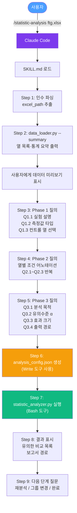
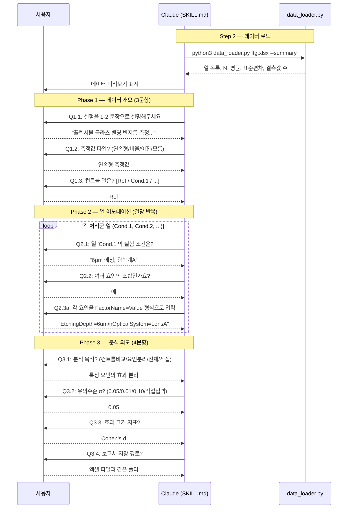
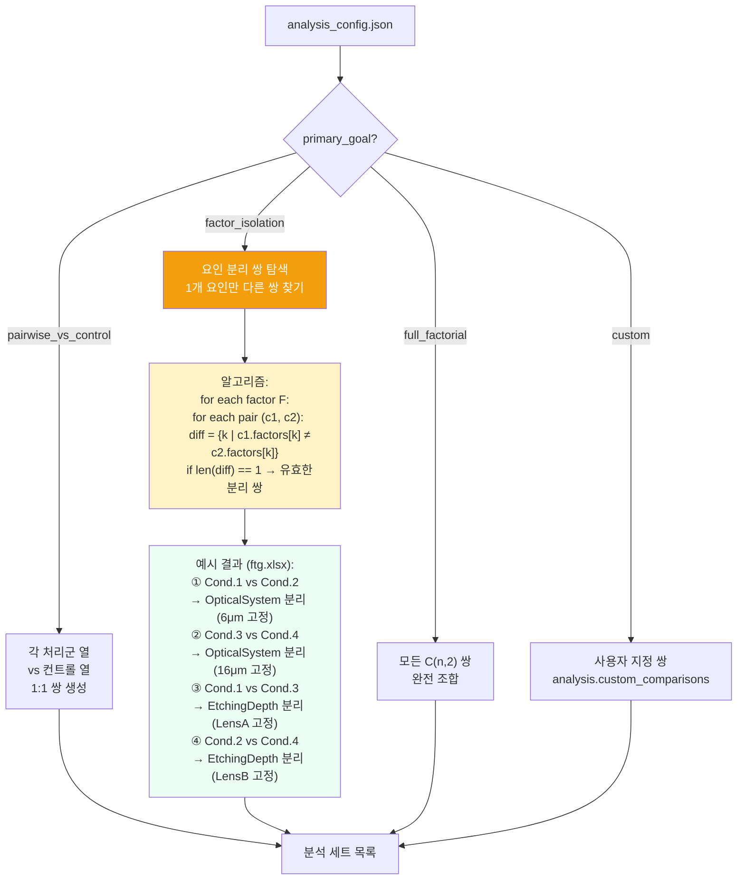
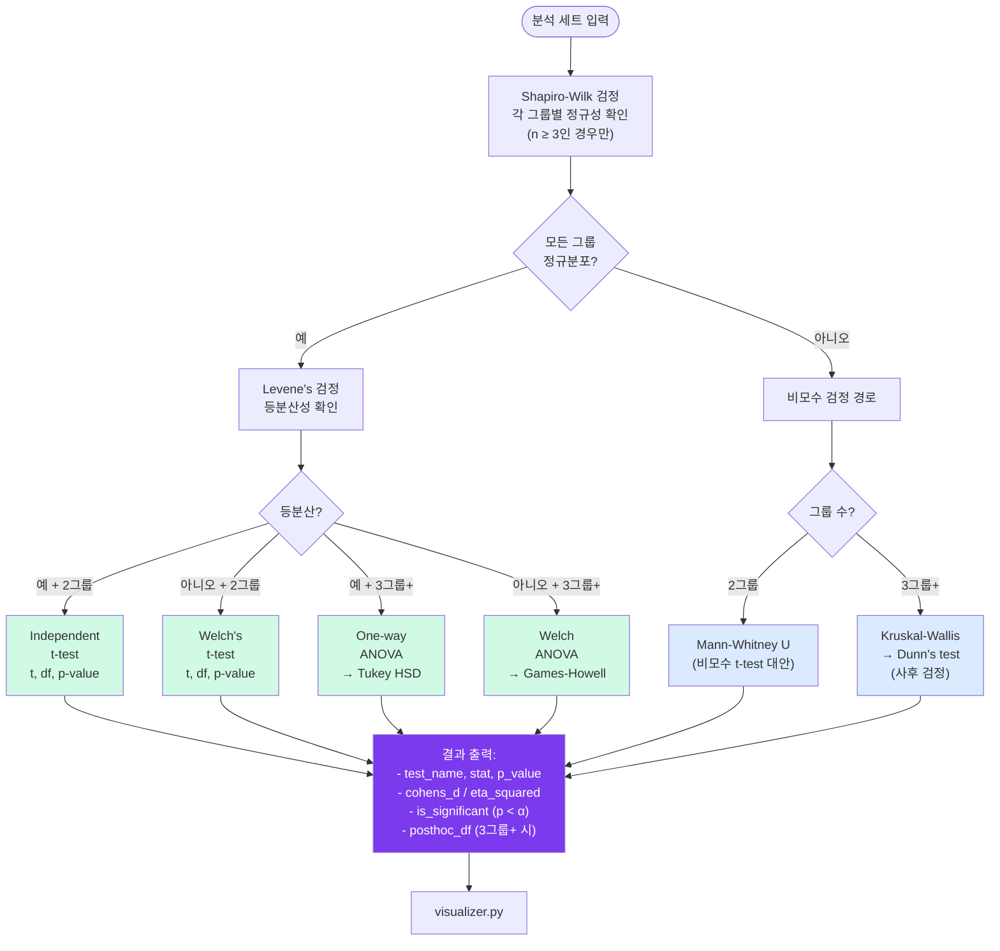
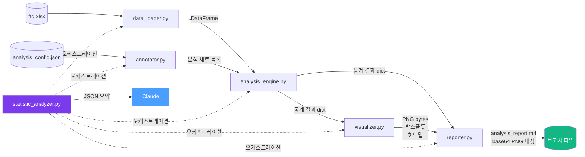
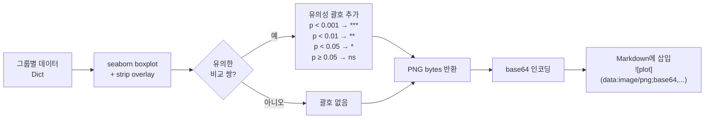
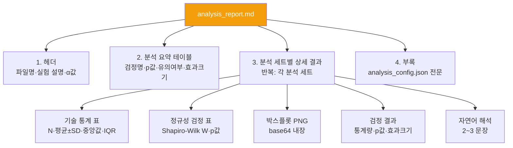
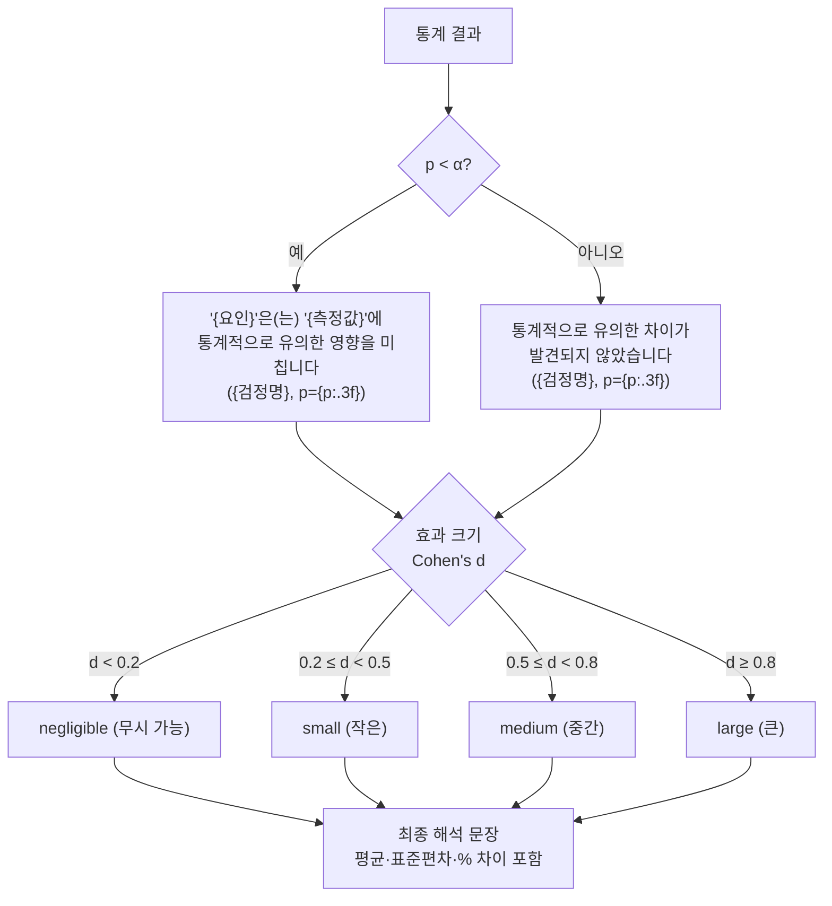

# statistic-analysis 스킬 아키텍처 문서

> 버전: 1.0.0 | 최종 수정: 2026-03-11

---

## 1. 개요

`statistic-analysis`는 MoAI Claude Code 스킬로, 사용자가 Excel 실험 데이터를 업로드하면 **대화형 질의 → 설정 자동 생성 → 통계 분석 → 대시보드 출력** 파이프라인을 자율적으로 실행한다.

### 핵심 설계 원칙

| 원칙 | 구현 방식 |
|------|-----------|
| **이식성** | 모든 Python 스크립트가 스킬 폴더 내부(`scripts/`)에 위치 |
| **자율성** | 정규성·등분산 검정 결과로 통계 검정을 자동 선택 |
| **투명성** | 각 분석 세트마다 검정 근거를 자연어로 설명 |
| **경로 안정성** | `${CLAUDE_SKILL_DIR}` 변수로 절대 경로 의존성 제거 |

---

## 2. 파일 구조

```
.claude/skills/statistic-analysis/
│
├── SKILL.md                          # 스킬 정의 (YAML frontmatter + 실행 지시문)
│   ├── [Level 1] Quick Reference     # ~100 tokens, 항상 로드
│   └── [Level 2] Execution Directive # ~5000 tokens, 트리거 시 로드
│
├── modules/
│   ├── questioning-protocol.md       # 질의 프로토콜 & 엣지 케이스
│   ├── test-selection-logic.md       # 통계 검정 결정 트리
│   └── interpretation-templates.md  # 자연어 해석 템플릿
│
└── scripts/                          # Python 분석 엔진
    ├── statistic_analyzer.py         # 메인 오케스트레이터 (CLI 진입점)
    ├── data_loader.py                 # Excel 로딩 + 요약 출력
    ├── annotator.py                   # 분석 세트 자동 구성
    ├── analysis_engine.py             # 통계 검정 선택 + 실행
    ├── visualizer.py                  # matplotlib/seaborn 시각화
    ├── reporter.py                    # Markdown 대시보드 조립
    └── requirements.txt               # 의존성 (pandas, scipy, matplotlib...)
```

---

## 3. 전체 실행 흐름



---

## 4. Phase 별 질의 흐름



---

## 5. `annotator.py` — 분석 세트 자동 구성 알고리즘



---

## 6. `analysis_engine.py` — 통계 검정 선택 결정 트리



---

## 7. Python 모듈 데이터 흐름



---

## 8. `visualizer.py` — 박스플롯 생성 로직



---

## 9. 보고서 (`analysis_report.md`) 구조



---

## 10. 자연어 해석 생성 로직



---

## 11. 스킬 트리거 조건

SKILL.md의 `triggers` 설정에 따라 Claude가 자동으로 스킬을 로드하는 조건:

```yaml
triggers:
  keywords:
    - statistics, Excel, xlsx
    - ANOVA, t-test, p-value
    - significance, experimental data
    - control group, box plot
    - 유의차, 통계 분석          # 한국어 트리거
  phases: [run]
```

| 트리거 유형 | 예시 |
|------------|------|
| 파일 확장자 | `ftg.xlsx` 언급 |
| 통계 키워드 | "t-test 해줘", "ANOVA 분석" |
| 한국어 키워드 | "유의차 확인", "통계 분석" |
| 직접 호출 | `/statistic-analysis data.xlsx` |

---

## 12. `analysis_config.json` 스키마

스킬이 Claude와 Python 엔진 사이의 **계약(contract)** 으로 사용하는 JSON 구조:

```json
{
  "source": {
    "file_path": "ftg.xlsx",
    "sheet_name": "Data"
  },
  "experiment": {
    "description": "플렉서블 글라스 벤딩 반지름 측정...",
    "response_type": "continuous",
    "control_column": "Ref"
  },
  "columns": {
    "Ref": {
      "role": "control",
      "label": "참조 (컨트롤)",
      "factors": {}
    },
    "Cond.1": {
      "role": "treatment",
      "label": "6μm 에칭, 광학계A",
      "factors": {
        "EtchingDepth": "6um",
        "OpticalSystem": "LensA"
      }
    }
  },
  "analysis": {
    "primary_goal": "factor_isolation",
    "alpha": 0.05,
    "effect_size_metrics": ["cohens_d"],
    "output_dir": ".",
    "analysis_sets": []  // annotator.py가 자동 채움
  }
}
```

---

## 13. 엣지 케이스 처리

| 상황 | 처리 방식 |
|------|-----------|
| n < 3인 그룹 | Shapiro-Wilk 생략, 보수적으로 비모수 검정 선택 |
| 결측값(NaN) | 열별 독립적으로 NaN 제거 후 분석 |
| 비수치형 열 | `data_loader.py`가 자동 감지·경고 후 제외 |
| 열이 10개 이상 | 배치 모드: 표 템플릿으로 일괄 입력 |
| 단일 열 파일 | 컨트롤만 존재 → 분석 세트 0개 → 오류 안내 |
| 그룹 크기 3:1 이상 차이 | `questioning-protocol.md` 경고 출력 |

---

## 14. 의존성 및 환경

```
pandas>=2.0.0       # Excel 로딩, 데이터프레임
scipy>=1.11.0       # 통계 검정 (shapiro, levene, ttest, mannwhitneyu, kruskal)
matplotlib>=3.7.0   # 박스플롯 렌더링
seaborn>=0.13.0     # 시각화 스타일링
openpyxl>=3.1.0     # Excel 파일 파싱
numpy>=1.24.0       # 수치 연산
scikit-posthocs>=0.9.0  # Dunn's test, Games-Howell
```

설치:
```bash
pip install -r .claude/skills/statistic-analysis/scripts/requirements.txt
```

---

*이 문서는 `statistic-analysis` 스킬 v1.0.0을 기준으로 작성되었습니다.*
