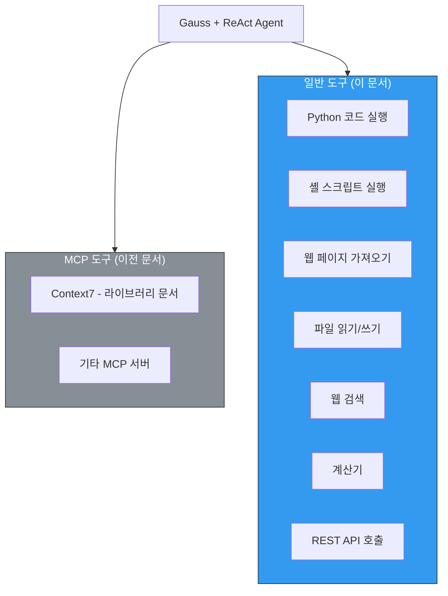
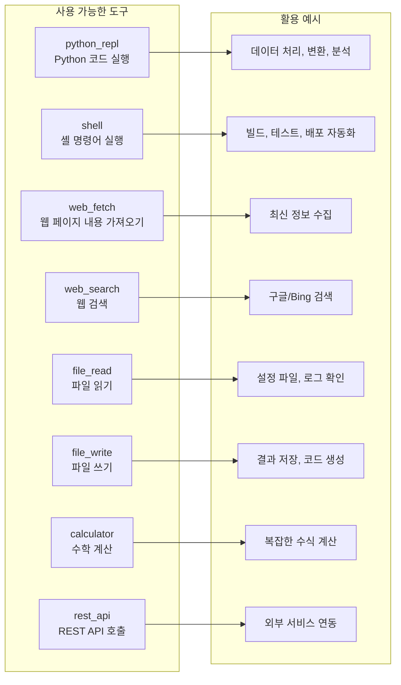
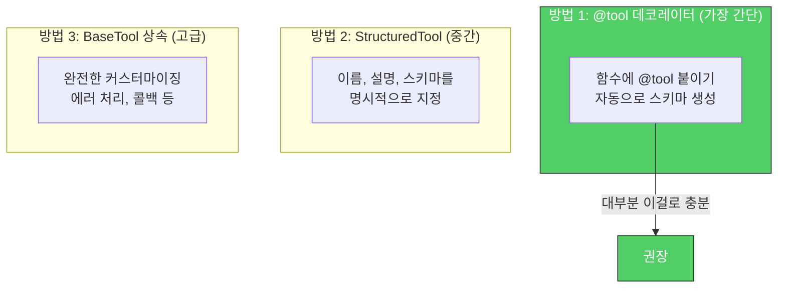
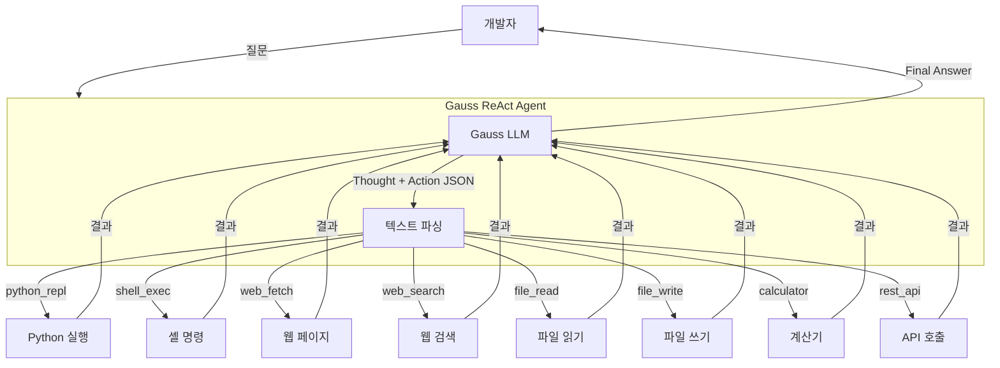
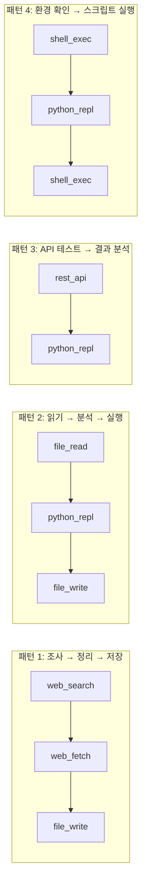
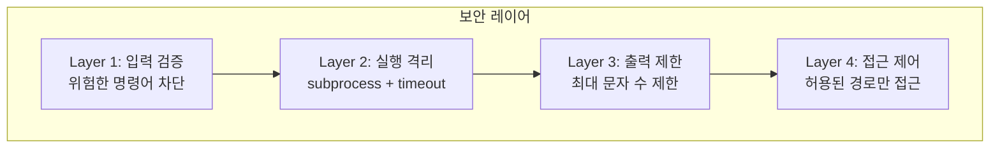
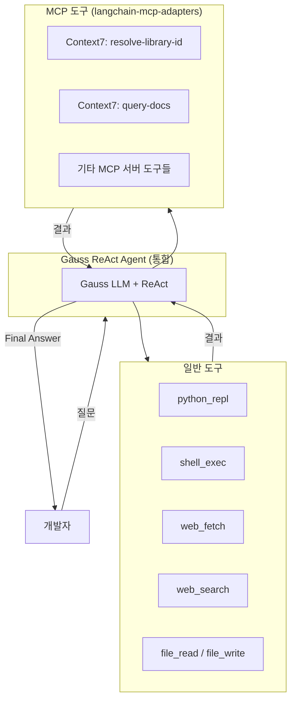
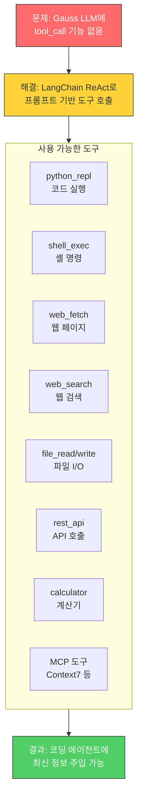

# Gauss 일반 Tool Calling 가이드

> 작성일: 2026-03-05
> 목적: Gauss LLM + LangChain ReAct로 다양한 도구(Python 실행, 스크립트, 웹 페치 등)를 사용하는 방법
> 선행 문서: gauss-mcp-integration-guide.md (Gauss LangChain 래핑 방법)

---

## 1. 이 문서의 범위

이전 문서(gauss-mcp-integration-guide.md)는 **MCP 특화** 기능이었습니다.
이 문서는 MCP 없이도 사용할 수 있는 **일반 도구들**을 다룹니다.



---

## 2. 도구 카탈로그

### 2.1 도구 목록과 용도



---

## 3. 도구 구현

### 3.1 도구 정의 방법

LangChain에서 도구를 만드는 3가지 방법:



### 3.2 전체 도구 코드

```python
"""tools.py - Gauss ReAct 에이전트용 일반 도구 모음"""

import subprocess
import json
import requests
from typing import Optional
from langchain_core.tools import tool


# ━━━━━━━━━━━━━━━━━━━━━━━━━━━━━━━━━━━━━━━━━━
# 도구 1: Python 코드 실행
# ━━━━━━━━━━━━━━━━━━━━━━━━━━━━━━━━━━━━━━━━━━

@tool
def python_repl(code: str) -> str:
    """Python 코드를 실행하고 결과를 반환합니다.
    데이터 처리, 계산, 파일 변환 등에 사용하세요.

    Args:
        code: 실행할 Python 코드
    """
    try:
        # 보안: exec 대신 subprocess로 격리 실행
        result = subprocess.run(
            ["python3", "-c", code],
            capture_output=True,
            text=True,
            timeout=30,  # 30초 타임아웃
        )
        if result.returncode == 0:
            return result.stdout.strip() or "(실행 완료, 출력 없음)"
        else:
            return f"에러: {result.stderr.strip()}"
    except subprocess.TimeoutExpired:
        return "에러: 실행 시간 초과 (30초)"
    except Exception as e:
        return f"에러: {str(e)}"


# ━━━━━━━━━━━━━━━━━━━━━━━━━━━━━━━━━━━━━━━━━━
# 도구 2: 셸 스크립트 실행
# ━━━━━━━━━━━━━━━━━━━━━━━━━━━━━━━━━━━━━━━━━━

@tool
def shell_exec(command: str) -> str:
    """셸 명령어를 실행하고 결과를 반환합니다.
    파일 목록 확인, git 명령, 빌드 실행 등에 사용하세요.
    위험한 명령(rm -rf, sudo 등)은 차단됩니다.

    Args:
        command: 실행할 셸 명령어
    """
    # 위험한 명령 차단
    dangerous = ["rm -rf", "sudo", "mkfs", "dd if=", "> /dev/", "chmod 777"]
    for d in dangerous:
        if d in command:
            return f"차단됨: 위험한 명령어 '{d}'는 실행할 수 없습니다."

    try:
        result = subprocess.run(
            command,
            shell=True,
            capture_output=True,
            text=True,
            timeout=30,
        )
        output = result.stdout.strip()
        if result.returncode != 0:
            output += f"\n(종료 코드: {result.returncode})\n{result.stderr.strip()}"
        return output or "(실행 완료, 출력 없음)"
    except subprocess.TimeoutExpired:
        return "에러: 실행 시간 초과 (30초)"
    except Exception as e:
        return f"에러: {str(e)}"


# ━━━━━━━━━━━━━━━━━━━━━━━━━━━━━━━━━━━━━━━━━━
# 도구 3: 웹 페이지 내용 가져오기 (Web Fetch)
# ━━━━━━━━━━━━━━━━━━━━━━━━━━━━━━━━━━━━━━━━━━

@tool
def web_fetch(url: str) -> str:
    """URL의 웹 페이지 내용을 가져옵니다.
    API 문서, 블로그 글, 공식 문서 등의 내용을 읽을 때 사용하세요.

    Args:
        url: 가져올 웹 페이지 URL
    """
    try:
        response = requests.get(
            url,
            timeout=15,
            headers={"User-Agent": "GaussBridge/1.0"},
        )
        response.raise_for_status()

        # HTML인 경우 텍스트만 추출
        content_type = response.headers.get("content-type", "")
        if "html" in content_type:
            try:
                from bs4 import BeautifulSoup
                soup = BeautifulSoup(response.text, "html.parser")
                # 스크립트, 스타일 태그 제거
                for tag in soup(["script", "style", "nav", "footer"]):
                    tag.decompose()
                text = soup.get_text(separator="\n", strip=True)
            except ImportError:
                # bs4 없으면 raw text 반환
                text = response.text
        else:
            text = response.text

        # 너무 길면 잘라서 반환 (토큰 절약)
        max_chars = 8000
        if len(text) > max_chars:
            text = text[:max_chars] + "\n\n...(이하 생략, 총 {0}자)".format(len(text))

        return text
    except requests.exceptions.Timeout:
        return "에러: 요청 시간 초과 (15초)"
    except requests.exceptions.RequestException as e:
        return f"에러: {str(e)}"


# ━━━━━━━━━━━━━━━━━━━━━━━━━━━━━━━━━━━━━━━━━━
# 도구 4: 웹 검색
# ━━━━━━━━━━━━━━━━━━━━━━━━━━━━━━━━━━━━━━━━━━

@tool
def web_search(query: str) -> str:
    """웹에서 정보를 검색합니다.
    최신 뉴스, 기술 정보, 문서를 찾을 때 사용하세요.

    Args:
        query: 검색어
    """
    # DuckDuckGo (API 키 불필요)
    try:
        from duckduckgo_search import DDGS
        with DDGS() as ddgs:
            results = list(ddgs.text(query, max_results=5))
            if not results:
                return "검색 결과 없음"

            output = []
            for r in results:
                output.append(f"제목: {r['title']}\nURL: {r['href']}\n요약: {r['body']}\n")
            return "\n---\n".join(output)
    except ImportError:
        return ("에러: duckduckgo-search 패키지가 필요합니다. "
                "pip install duckduckgo-search 로 설치하세요.")
    except Exception as e:
        return f"에러: {str(e)}"


# ━━━━━━━━━━━━━━━━━━━━━━━━━━━━━━━━━━━━━━━━━━
# 도구 5: 파일 읽기
# ━━━━━━━━━━━━━━━━━━━━━━━━━━━━━━━━━━━━━━━━━━

@tool
def file_read(filepath: str) -> str:
    """로컬 파일의 내용을 읽어서 반환합니다.

    Args:
        filepath: 읽을 파일의 경로
    """
    try:
        with open(filepath, "r", encoding="utf-8") as f:
            content = f.read()
        max_chars = 8000
        if len(content) > max_chars:
            content = content[:max_chars] + f"\n\n...(이하 생략, 총 {len(content)}자)"
        return content
    except FileNotFoundError:
        return f"에러: 파일을 찾을 수 없습니다 - {filepath}"
    except Exception as e:
        return f"에러: {str(e)}"


# ━━━━━━━━━━━━━━━━━━━━━━━━━━━━━━━━━━━━━━━━━━
# 도구 6: 파일 쓰기
# ━━━━━━━━━━━━━━━━━━━━━━━━━━━━━━━━━━━━━━━━━━

@tool
def file_write(filepath: str, content: str) -> str:
    """파일에 내용을 씁니다. 이미 존재하면 덮어씁니다.

    Args:
        filepath: 쓸 파일의 경로
        content: 파일에 쓸 내용
    """
    try:
        import os
        os.makedirs(os.path.dirname(filepath) or ".", exist_ok=True)
        with open(filepath, "w", encoding="utf-8") as f:
            f.write(content)
        return f"파일 저장 완료: {filepath} ({len(content)}자)"
    except Exception as e:
        return f"에러: {str(e)}"


# ━━━━━━━━━━━━━━━━━━━━━━━━━━━━━━━━━━━━━━━━━━
# 도구 7: 계산기
# ━━━━━━━━━━━━━━━━━━━━━━━━━━━━━━━━━━━━━━━━━━

@tool
def calculator(expression: str) -> str:
    """수학 표현식을 계산합니다.

    Args:
        expression: 계산할 수학 표현식 (예: "2 + 3 * 4")
    """
    try:
        # 안전한 수학 연산만 허용
        allowed = set("0123456789+-*/.() ")
        if not all(c in allowed for c in expression):
            return "에러: 허용되지 않는 문자가 포함되어 있습니다."
        result = eval(expression)  # noqa: S307 - 입력 검증 완료
        return str(result)
    except Exception as e:
        return f"에러: {str(e)}"


# ━━━━━━━━━━━━━━━━━━━━━━━━━━━━━━━━━━━━━━━━━━
# 도구 8: REST API 호출
# ━━━━━━━━━━━━━━━━━━━━━━━━━━━━━━━━━━━━━━━━━━

@tool
def rest_api(
    method: str,
    url: str,
    body: Optional[str] = None,
    headers: Optional[str] = None,
) -> str:
    """REST API를 호출하고 응답을 반환합니다.

    Args:
        method: HTTP 메서드 (GET, POST, PUT, DELETE)
        url: API URL
        body: JSON 형식의 요청 본문 (POST/PUT 시)
        headers: JSON 형식의 추가 헤더
    """
    try:
        req_headers = {"Content-Type": "application/json"}
        if headers:
            req_headers.update(json.loads(headers))

        req_body = json.loads(body) if body else None

        response = requests.request(
            method=method.upper(),
            url=url,
            json=req_body,
            headers=req_headers,
            timeout=15,
        )

        result = {
            "status_code": response.status_code,
            "body": response.text[:4000],  # 응답 크기 제한
        }
        return json.dumps(result, ensure_ascii=False, indent=2)
    except Exception as e:
        return f"에러: {str(e)}"
```

---

## 4. 에이전트 조립: 도구 + Gauss + ReAct

### 4.1 전체 흐름



### 4.2 에이전트 조립 코드

```python
"""agent.py - 모든 도구를 갖춘 Gauss 에이전트"""

from gauss_llm import ChatGauss
from react_agent import create_gauss_agent
from tools import (
    python_repl,
    shell_exec,
    web_fetch,
    web_search,
    file_read,
    file_write,
    calculator,
    rest_api,
)


def create_full_agent(gauss_config: dict):
    """모든 도구를 갖춘 Gauss 에이전트 생성"""

    gauss = ChatGauss(**gauss_config)

    tools = [
        python_repl,
        shell_exec,
        web_fetch,
        web_search,
        file_read,
        file_write,
        calculator,
        rest_api,
    ]

    return create_gauss_agent(gauss, tools)


# 실행
if __name__ == "__main__":
    import os

    config = {
        "endpoint_url": os.environ["GAUSS_ENDPOINT"],
        "client_key": os.environ["GAUSS_CLIENT_KEY"],
        "pass_key": os.environ["GAUSS_PASS_KEY"],
        "user_email": os.environ["GAUSS_EMAIL"],
        "model_id": os.environ["GAUSS_MODEL_ID"],
    }

    agent = create_full_agent(config)

    # 대화형 루프
    while True:
        question = input("\n질문: ")
        if question.lower() in ("exit", "quit", "q"):
            break
        result = agent.invoke({"input": question})
        print(f"\n답변: {result['output']}")
```

---

## 5. 실제 사용 시나리오

### 5.1 시나리오 맵

```mermaid
graph TB
    subgraph SCENARIO1 ["시나리오 1: 코드 생성 + 실행"]
        S1Q["피보나치 수열 100번째 값 구해줘"]
        S1A["python_repl로 코드 실행"]
        S1R["354224848179261915075"]
        S1Q --> S1A --> S1R
    end

    subgraph SCENARIO2 ["시나리오 2: 웹 조사 + 정리"]
        S2Q["Next.js 16 새 기능 알려줘"]
        S2A["web_search → web_fetch → 정리"]
        S2R["Skills 파일로 저장"]
        S2Q --> S2A --> S2R
    end

    subgraph SCENARIO3 ["시나리오 3: 파일 분석"]
        S3Q["이 로그 파일에서 에러 찾아줘"]
        S3A["file_read → python_repl로 분석"]
        S3R["에러 패턴 리포트"]
        S3Q --> S3A --> S3R
    end

    subgraph SCENARIO4 ["시나리오 4: API 테스트"]
        S4Q["사내 API 헬스체크 해줘"]
        S4A["rest_api로 GET 호출"]
        S4R["상태 코드 + 응답 확인"]
        S4Q --> S4A --> S4R
    end
```



### 5.2 시나리오별 ReAct 동작 예시

#### 시나리오 1: Python 코드 실행

```
질문: CSV 파일을 읽어서 매출 합계를 구해줘. 파일 경로는 data/sales.csv

Thought: CSV 파일을 읽고 매출 합계를 계산해야 합니다. python_repl 도구를 사용하겠습니다.
Action: python_repl
Action Input: import csv; total = sum(float(row[2]) for row in csv.reader(open('data/sales.csv')) if row[2] != 'amount'); print(f'매출 합계: {total:,.0f}원')
Observation: 매출 합계: 45,230,000원
Thought: 이제 최종 답변을 알았습니다.
Final Answer: data/sales.csv 파일의 매출 합계는 45,230,000원입니다.
```

#### 시나리오 2: 웹 검색 + 페이지 가져오기

```
질문: Python 3.13의 새로운 기능을 알려줘

Thought: Python 3.13 새 기능을 검색해야 합니다.
Action: web_search
Action Input: Python 3.13 new features changelog 2025
Observation: 제목: What's New In Python 3.13
          URL: https://docs.python.org/3.13/whatsnew/3.13.html
          ...

Thought: 공식 문서를 직접 읽어보겠습니다.
Action: web_fetch
Action Input: https://docs.python.org/3.13/whatsnew/3.13.html
Observation: (문서 내용...)

Thought: 이제 최종 답변을 알았습니다.
Final Answer: Python 3.13의 주요 새 기능은...
```

#### 시나리오 3: 셸 명령 + 파일 분석

```
질문: 현재 디렉토리의 Go 파일 중 테스트가 없는 파일을 찾아줘

Thought: Go 파일 목록을 확인하고 테스트 파일과 비교해야 합니다.
Action: shell_exec
Action Input: find . -name "*.go" ! -name "*_test.go" -type f | sort
Observation: ./cmd/main.go
            ./internal/handler/user.go
            ./internal/service/auth.go

Thought: 테스트 파일이 있는지 확인하겠습니다.
Action: shell_exec
Action Input: find . -name "*_test.go" -type f | sort
Observation: ./internal/handler/user_test.go

Thought: 이제 최종 답변을 알았습니다.
Final Answer: 테스트가 없는 Go 파일:
- ./cmd/main.go (main 패키지라 테스트 생략 가능)
- ./internal/service/auth.go (테스트 작성 권장)
```

---

## 6. 도구 조합 패턴

### 6.1 자주 쓰는 도구 체인



### 6.2 도구 선택 프롬프트 보강

Gauss가 도구를 더 정확하게 선택하도록 프롬프트를 보강할 수 있습니다:

```python
"""도구 선택 가이드를 프롬프트에 추가"""

TOOL_SELECTION_GUIDE = """
도구 선택 기준:
- 수학 계산이 필요하면 → calculator
- Python 코드 실행이 필요하면 → python_repl
- 셸 명령(ls, git, grep 등)이 필요하면 → shell_exec
- 웹 페이지 내용을 읽어야 하면 → web_fetch
- 정보를 검색해야 하면 → web_search
- 로컬 파일을 읽어야 하면 → file_read
- 파일을 저장해야 하면 → file_write
- HTTP API를 호출해야 하면 → rest_api

주의사항:
- 한 번에 하나의 도구만 사용하세요
- 간단한 계산은 calculator를, 복잡한 로직은 python_repl을 사용하세요
- web_fetch는 URL을 알 때, web_search는 URL을 모를 때 사용하세요
"""
```

---

## 7. 보안 고려사항

### 7.1 보안 레이어



### 7.2 각 도구별 보안 조치

| 도구 | 위험 | 대응 |
| --- | --- | --- |
| python_repl | 임의 코드 실행 | subprocess 격리, 30초 타임아웃 |
| shell_exec | 시스템 명령 실행 | 위험 명령 블랙리스트, 타임아웃 |
| web_fetch | SSRF 공격 | 사내 IP 대역 차단, 타임아웃 |
| file_read | 민감 파일 접근 | 허용 디렉토리 화이트리스트 (선택) |
| file_write | 시스템 파일 변조 | 허용 디렉토리 화이트리스트 (선택) |
| rest_api | 내부 API 무단 호출 | URL 화이트리스트 (선택) |

### 7.3 보안 강화 옵션 (프로덕션용)

```python
"""security.py - 보안 강화 래퍼"""

ALLOWED_DIRS = ["./data", "./output", "./skills", "/tmp"]
BLOCKED_URLS = ["169.254.169.254", "localhost", "127.0.0.1", "10."]


def validate_filepath(filepath: str) -> bool:
    """허용된 디렉토리 내 파일만 접근 가능"""
    import os
    abs_path = os.path.abspath(filepath)
    return any(abs_path.startswith(os.path.abspath(d)) for d in ALLOWED_DIRS)


def validate_url(url: str) -> bool:
    """내부 네트워크 접근 차단 (SSRF 방지)"""
    from urllib.parse import urlparse
    host = urlparse(url).hostname or ""
    return not any(blocked in host for blocked in BLOCKED_URLS)
```

---

## 8. MCP 도구와 일반 도구 함께 사용하기

### 8.1 통합 아키텍처



### 8.2 통합 에이전트 코드

```python
"""unified_agent.py - MCP + 일반 도구 통합 에이전트"""

import asyncio
from langchain_mcp_adapters.client import MultiServerMCPClient
from gauss_llm import ChatGauss
from react_agent import create_gauss_agent
from tools import (
    python_repl, shell_exec, web_fetch, web_search,
    file_read, file_write, calculator, rest_api,
)


async def create_unified_agent(gauss_config: dict):
    """일반 도구 + MCP 도구를 모두 갖춘 통합 에이전트"""

    gauss = ChatGauss(**gauss_config)

    # 일반 도구
    general_tools = [
        python_repl, shell_exec, web_fetch, web_search,
        file_read, file_write, calculator, rest_api,
    ]

    # MCP 도구 (Context7 등)
    async with MultiServerMCPClient(servers={
        "context7": {
            "command": "npx",
            "args": ["-y", "@upstash/context7-mcp@latest"],
            "transport": "stdio",
        }
    }) as client:
        mcp_tools = client.get_tools()

        # 모든 도구 합치기
        all_tools = general_tools + mcp_tools

        agent = create_gauss_agent(gauss, all_tools)

        # 이제 에이전트는 일반 도구와 MCP 도구를 모두 사용 가능
        result = agent.invoke({
            "input": "React 19의 useEffect 최신 사용법을 Context7에서 찾고, "
                     "예제 코드를 skills/react-useeffect.md 파일로 저장해줘"
        })
        return result
```

---

## 9. 의존성 설치

```bash
# 필수
pip install langchain langchain-core requests

# 선택 (사용하는 도구에 따라)
pip install beautifulsoup4        # web_fetch HTML 파싱용
pip install duckduckgo-search     # web_search용
pip install langchain-mcp-adapters  # MCP 연동 시
pip install langgraph             # LangGraph 고급 버전 사용 시
```

---

## 10. 요약



| 도구 | 용도 | 사내 사용 예시 |
| --- | --- | --- |
| python_repl | 코드 실행/데이터 처리 | CSV 분석, JSON 변환, 데이터 검증 |
| shell_exec | 시스템 명령 | git log, grep, 빌드 스크립트 |
| web_fetch | 웹 페이지 읽기 | API 문서, 블로그, 릴리스 노트 |
| web_search | 정보 검색 | 최신 기술 동향, 에러 해결법 |
| file_read/write | 파일 I/O | 설정 파일, 로그, Skills 파일 생성 |
| rest_api | API 호출 | 사내 API 테스트, 헬스체크 |
| calculator | 수학 계산 | 성능 메트릭, 비용 계산 |
| MCP 도구 | 외부 MCP 서버 | Context7 최신 문서 검색 |
