# Gauss LLM + MCP 통합 가이드

> 작성일: 2026-03-05 목적: 사내 Gauss LLM을 LangChain/LangGraph로 래핑하고, Context7 MCP를 연동하여 코딩 에이전트에 최신 정보를 주입하는 방법

---

## 1. 전체 그림: 무엇을 왜 하는가

### 1.1 문제 상황

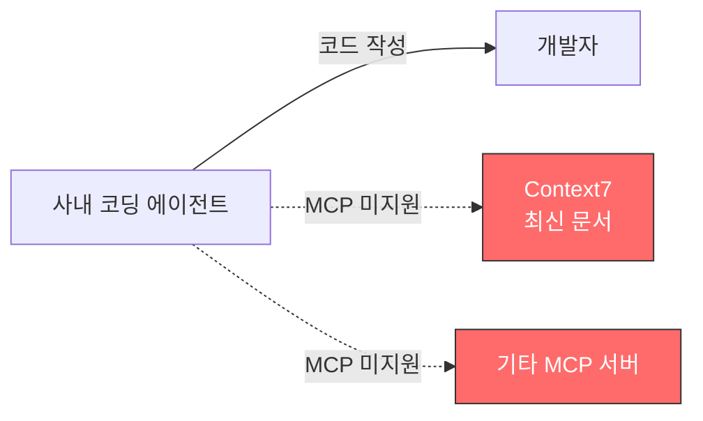

- 사내 코딩 에이전트는 **MCP를 지원하지 않음**
- 따라서 Context7 같은 MCP 서버에서 최신 라이브러리 문서를 가져올 수 없음
- 개발자가 수동으로 문서를 찾아서 복사-붙여넣기 해야 함

### 1.2 해결 방법

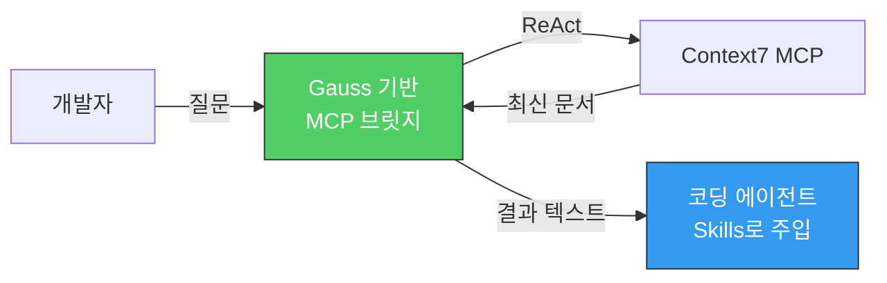

Gauss LLM을 \*\*중간 다리(브릿지)\*\*로 활용하여:

1. Gauss가 LangChain ReAct로 Context7 MCP를 호출
2. 최신 문서를 가져와서
3. 코딩 에이전트의 **Skills**로 결과를 밀어넣음

---

## 2. 시스템 아키텍처

### 2.1 전체 흐름

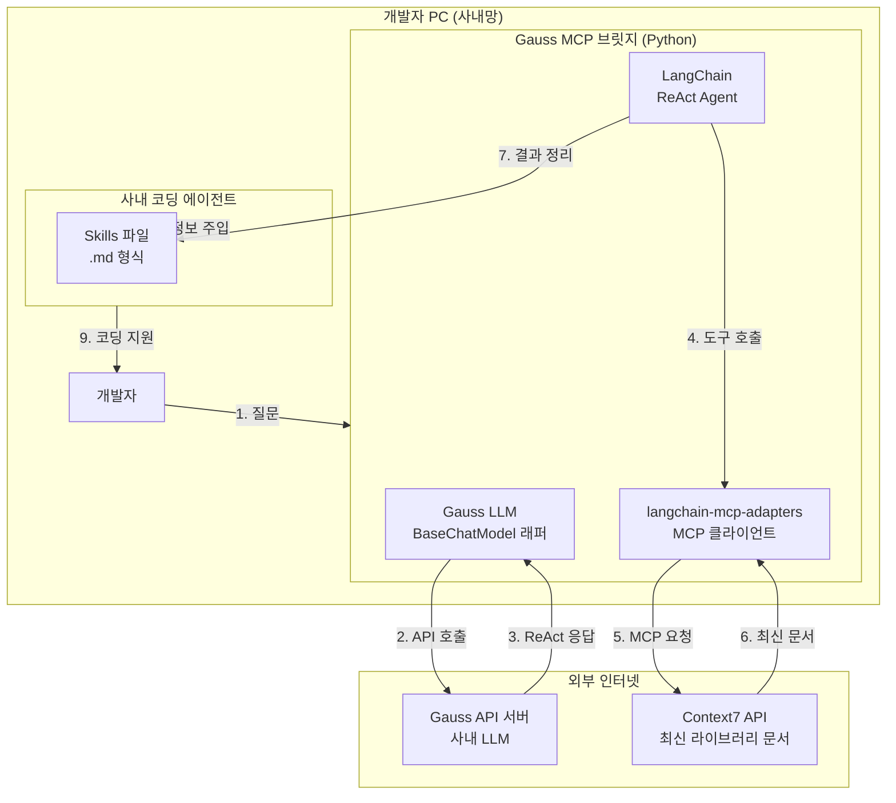

### 2.2 데이터 흐름 요약

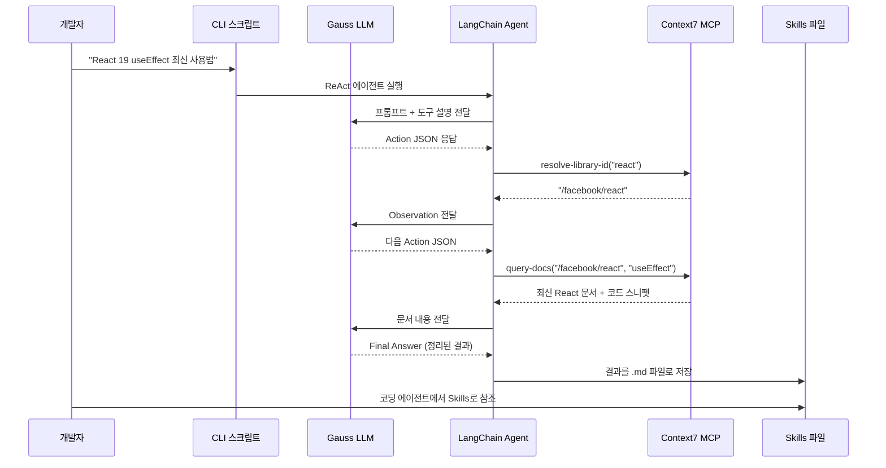

---

## 3. Step 1: Gauss LLM을 LangChain으로 래핑

### 3.1 Gauss API 구조 (gauss-api.md 기반)

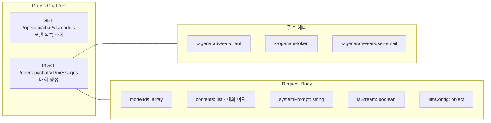

### 3.2 BaseChatModel 래퍼 구현

```python
"""gauss_llm.py - Gauss LLM을 LangChain ChatModel로 래핑"""

import requests
from typing import Any, List, Optional
from langchain_core.language_models.chat_models import BaseChatModel
from langchain_core.messages import (
    AIMessage, BaseMessage, HumanMessage, SystemMessage
)
from langchain_core.outputs import ChatResult, ChatGeneration
from langchain_core.callbacks import CallbackManagerForLLMRun
from pydantic import Field


class ChatGauss(BaseChatModel):
    """사내 Gauss LLM을 위한 LangChain 래퍼"""

    # === 필수 설정 ===
    endpoint_url: str = Field(description="Gauss API 엔드포인트 URL")
    client_key: str = Field(description="x-generative-ai-client 키")
    pass_key: str = Field(description="x-openapi-token 키")
    user_email: str = Field(description="사용자 이메일")
    model_id: str = Field(description="Gauss 모델 ID")

    # === 선택 설정 (기본값 있음) ===
    temperature: float = 0.4
    max_new_tokens: int = 2048
    top_k: int = 14
    top_p: float = 0.94
    repetition_penalty: float = 1.04

    @property
    def _llm_type(self) -> str:
        return "gauss"

    def _convert_messages(self, messages: List[BaseMessage]) -> tuple:
        """LangChain 메시지를 Gauss API 형식으로 변환"""

        system_prompt = ""
        contents = []

        for msg in messages:
            if isinstance(msg, SystemMessage):
                system_prompt = msg.content
            elif isinstance(msg, HumanMessage):
                contents.append(msg.content)
            elif isinstance(msg, AIMessage):
                contents.append(msg.content)

        return system_prompt, contents

    def _generate(
        self,
        messages: List[BaseMessage],
        stop: Optional[List[str]] = None,
        run_manager: Optional[CallbackManagerForLLMRun] = None,
        **kwargs: Any,
    ) -> ChatResult:
        """Gauss API를 호출하여 응답 생성"""

        system_prompt, contents = self._convert_messages(messages)

        # Gauss API 요청 구성
        headers = {
            "Content-Type": "application/json",
            "x-generative-ai-client": self.client_key,
            "x-openapi-token": self.pass_key,
            "x-generative-ai-user-email": self.user_email,
        }

        body = {
            "modelIds": [self.model_id],
            "contents": contents,
            "systemPrompt": system_prompt,
            "isStream": False,
            "llmConfig": {
                "temperature": self.temperature,
                "max_new_tokens": self.max_new_tokens,
                "top_k": self.top_k,
                "top_p": self.top_p,
                "repetition_penalty": self.repetition_penalty,
            },
        }

        # API 호출
        api_url = f"{self.endpoint_url}/openapi/chat/v1/messages"
        response = requests.post(api_url, headers=headers, json=body)
        response.raise_for_status()

        result = response.json()
        content = result.get("content", "")

        # stop 토큰 처리
        if stop:
            for s in stop:
                if s in content:
                    content = content[:content.index(s)]

        # LangChain 형식으로 반환
        message = AIMessage(content=content)
        generation = ChatGeneration(message=message)
        return ChatResult(generations=[generation])
```

### 3.3 사용 예시

```python
from gauss_llm import ChatGauss

# Gauss LLM 초기화
gauss = ChatGauss(
    endpoint_url="http://gauss-internal.company.com",
    client_key="YOUR_CLIENT_KEY",
    pass_key="YOUR_PASS_KEY",
    user_email="your@company.com",
    model_id="your-model-id",
)

# 기본 대화 테스트
response = gauss.invoke("안녕하세요, Gauss!")
print(response.content)
```

---

## 4. Step 2: ReAct 에이전트로 도구 호출 가능하게 만들기

### 4.1 왜 ReAct인가

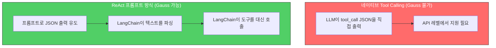

### 4.2 ReAct 에이전트 설정

```python
"""react_agent.py - Gauss + ReAct 에이전트"""

from langchain.agents import create_react_agent, AgentExecutor
from langchain_core.prompts import PromptTemplate
from gauss_llm import ChatGauss

# ReAct 프롬프트 템플릿
REACT_PROMPT = PromptTemplate.from_template("""다음 도구를 사용하여 질문에 답변하세요.

사용 가능한 도구:
{tools}

반드시 아래 형식을 따르세요:

Question: 답변해야 할 질문
Thought: 무엇을 해야 할지 생각합니다
Action: 사용할 도구 이름 (다음 중 하나: {tool_names})
Action Input: 도구에 전달할 입력
Observation: 도구 실행 결과
... (Thought/Action/Action Input/Observation 반복 가능)
Thought: 이제 최종 답을 알았습니다
Final Answer: 최종 답변

시작하세요!

Question: {input}
{agent_scratchpad}""")


def create_gauss_agent(gauss_llm: ChatGauss, tools: list) -> AgentExecutor:
    """Gauss LLM으로 ReAct 에이전트를 생성"""

    agent = create_react_agent(
        llm=gauss_llm,
        tools=tools,
        prompt=REACT_PROMPT,
    )

    return AgentExecutor(
        agent=agent,
        tools=tools,
        verbose=True,         # 디버깅용: 추론 과정 출력
        max_iterations=5,     # 무한 루프 방지
        handle_parsing_errors=True,  # JSON 파싱 실패 시 재시도
    )
```

---

## 5. Step 3: Context7 MCP 연결

### 5.1 연결 구조

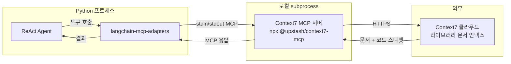

### 5.2 Context7 MCP 연동 코드

```python
"""context7_bridge.py - Context7 MCP를 Gauss ReAct로 연동"""

import asyncio
from langchain_mcp_adapters.client import MultiServerMCPClient
from gauss_llm import ChatGauss
from react_agent import create_gauss_agent


async def query_context7(question: str, gauss_config: dict) -> str:
    """Context7에서 최신 라이브러리 문서를 검색하여 반환"""

    # 1. Gauss LLM 초기화
    gauss = ChatGauss(**gauss_config)

    # 2. Context7 MCP 서버 연결
    async with MultiServerMCPClient(servers={
        "context7": {
            "command": "npx",
            "args": ["-y", "@upstash/context7-mcp@latest"],
            "transport": "stdio",
        }
    }) as client:
        # 3. MCP 도구를 LangChain 도구로 변환
        tools = client.get_tools()
        # tools = [resolve_library_id, query_docs]

        # 4. ReAct 에이전트 생성 및 실행
        agent_executor = create_gauss_agent(gauss, tools)
        result = agent_executor.invoke({"input": question})

        return result["output"]


# 실행 예시
if __name__ == "__main__":
    config = {
        "endpoint_url": "http://gauss-internal.company.com",
        "client_key": "YOUR_CLIENT_KEY",
        "pass_key": "YOUR_PASS_KEY",
        "user_email": "your@company.com",
        "model_id": "your-model-id",
    }

    answer = asyncio.run(
        query_context7("React 19의 useEffect 최신 사용법을 알려줘", config)
    )
    print(answer)
```

### 5.3 내부 동작 과정

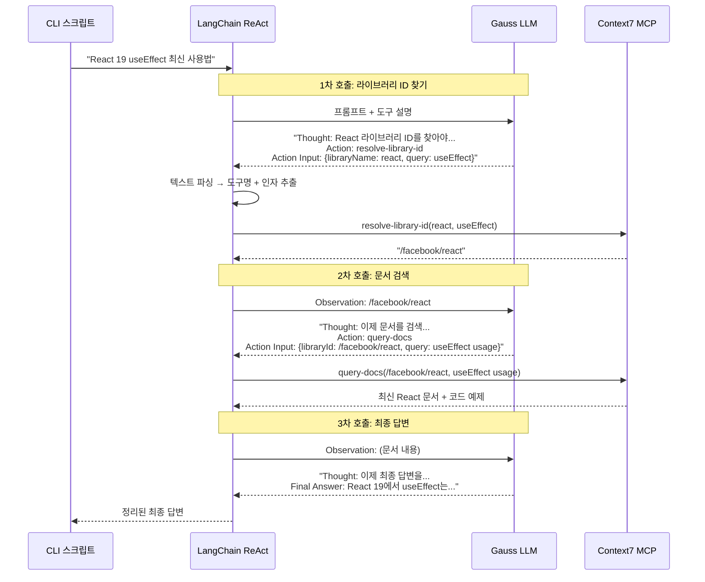

---

## 6. Step 4: 코딩 에이전트에 결과 주입 (Skills)

### 6.1 전체 워크플로우

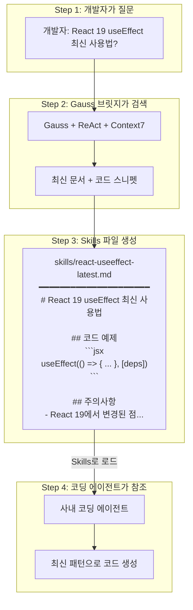

### 6.2 Skills 파일 자동 생성 스크립트

```python
"""skill_generator.py - Context7 결과를 Skills 파일로 변환"""

import asyncio
import os
from datetime import datetime
from context7_bridge import query_context7


def generate_skill_file(topic: str, content: str, output_dir: str = "skills"):
    """Context7 결과를 코딩 에이전트용 Skills .md 파일로 저장"""

    os.makedirs(output_dir, exist_ok=True)

    # 파일명 생성 (예: react-useeffect-latest.md)
    safe_name = topic.lower().replace(" ", "-").replace("/", "-")[:50]
    filename = f"{safe_name}.md"
    filepath = os.path.join(output_dir, filename)

    # Skills 파일 작성
    skill_content = f"""# {topic}

> 자동 생성일: {datetime.now().strftime("%Y-%m-%d %H:%M")}
> 소스: Context7 MCP (최신 공식 문서 기반)

---

{content}

---

> 이 문서는 Gauss MCP 브릿지를 통해 자동 생성되었습니다.
> 최신 정보가 필요하면 다시 생성하세요.
"""

    with open(filepath, "w", encoding="utf-8") as f:
        f.write(skill_content)

    print(f"Skills 파일 생성됨: {filepath}")
    return filepath


async def create_skill(topic: str, gauss_config: dict):
    """질문 → Context7 검색 → Skills 파일 생성 원스톱 함수"""

    # Context7에서 최신 문서 검색
    content = await query_context7(
        f"{topic}에 대한 최신 사용법, 코드 예제, 주의사항을 정리해줘",
        gauss_config,
    )

    # Skills 파일로 저장
    filepath = generate_skill_file(topic, content)
    return filepath


# 사용 예시
if __name__ == "__main__":
    config = {
        "endpoint_url": "http://gauss-internal.company.com",
        "client_key": "YOUR_CLIENT_KEY",
        "pass_key": "YOUR_PASS_KEY",
        "user_email": "your@company.com",
        "model_id": "your-model-id",
    }

    # 여러 주제에 대해 Skills 파일 일괄 생성
    topics = [
        "React 19 useEffect",
        "Next.js 16 App Router",
        "LangChain create_react_agent",
    ]

    for topic in topics:
        asyncio.run(create_skill(topic, config))
```

### 6.3 CLI 도구로 만들기

```python
"""gauss_skill_cli.py - 커맨드라인에서 바로 사용"""

import argparse
import asyncio
from skill_generator import create_skill


def main():
    parser = argparse.ArgumentParser(
        description="Gauss MCP 브릿지: 최신 라이브러리 문서를 Skills 파일로 생성"
    )
    parser.add_argument("topic", help="검색할 주제 (예: 'React 19 useEffect')")
    parser.add_argument("--output", "-o", default="skills", help="출력 디렉토리")

    args = parser.parse_args()

    # 환경변수에서 설정 로드
    import os
    config = {
        "endpoint_url": os.environ["GAUSS_ENDPOINT"],
        "client_key": os.environ["GAUSS_CLIENT_KEY"],
        "pass_key": os.environ["GAUSS_PASS_KEY"],
        "user_email": os.environ["GAUSS_EMAIL"],
        "model_id": os.environ["GAUSS_MODEL_ID"],
    }

    asyncio.run(create_skill(args.topic, config))


if __name__ == "__main__":
    main()
```

사용법:

```bash
# 환경변수 설정
export GAUSS_ENDPOINT="http://gauss-internal.company.com"
export GAUSS_CLIENT_KEY="your-key"
export GAUSS_PASS_KEY="your-pass"
export GAUSS_EMAIL="your@company.com"
export GAUSS_MODEL_ID="your-model-id"

# Skills 파일 생성
python gauss_skill_cli.py "React 19 useEffect"
python gauss_skill_cli.py "Next.js 16 서버 컴포넌트"
python gauss_skill_cli.py "TypeScript 5.9 새 기능"
```

---

## 7. LangGraph를 사용한 고급 버전

ReAct 에이전트 대신 **LangGraph**로 더 세밀한 제어가 가능합니다.

### 7.1 LangGraph 워크플로우

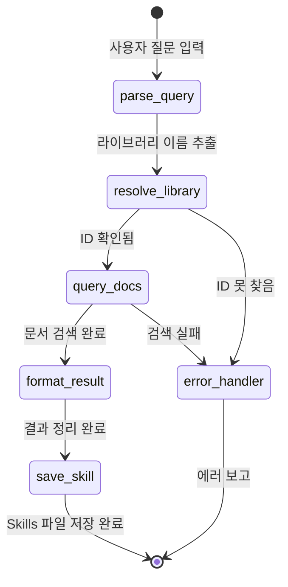

### 7.2 LangGraph 구현 (도구 호출 직접 제어)

```python
"""langgraph_bridge.py - LangGraph로 MCP 브릿지 구현 (ReAct 없이 직접 제어)"""

import asyncio
import json
import re
from typing import TypedDict, Literal
from langgraph.graph import StateGraph, START, END
from langchain_mcp_adapters.client import MultiServerMCPClient
from gauss_llm import ChatGauss


class BridgeState(TypedDict):
    """워크플로우 상태"""
    query: str              # 사용자 질문
    library_name: str       # 추출된 라이브러리 이름
    library_id: str         # Context7 라이브러리 ID
    docs_content: str       # 검색된 문서 내용
    final_answer: str       # 최종 정리된 답변
    error: str              # 에러 메시지


def parse_query(state: BridgeState) -> BridgeState:
    """사용자 질문에서 라이브러리 이름 추출 (Gauss 사용)"""

    gauss = _get_gauss()
    response = gauss.invoke(
        f"다음 질문에서 프로그래밍 라이브러리/프레임워크 이름만 추출하세요. "
        f"이름만 한 단어로 답하세요.\n\n질문: {state['query']}"
    )
    return {"library_name": response.content.strip()}


async def resolve_library(state: BridgeState) -> BridgeState:
    """Context7에서 라이브러리 ID 조회"""

    async with _get_mcp_client() as client:
        tools = client.get_tools()
        resolve_tool = next(t for t in tools if "resolve" in t.name)
        result = await resolve_tool.ainvoke({
            "libraryName": state["library_name"],
            "query": state["query"],
        })
        # 첫 번째 결과의 ID 추출
        library_id = _extract_library_id(result)
        return {"library_id": library_id}


async def query_docs(state: BridgeState) -> BridgeState:
    """Context7에서 문서 검색"""

    async with _get_mcp_client() as client:
        tools = client.get_tools()
        query_tool = next(t for t in tools if "query" in t.name)
        result = await query_tool.ainvoke({
            "libraryId": state["library_id"],
            "query": state["query"],
        })
        return {"docs_content": result}


def format_result(state: BridgeState) -> BridgeState:
    """Gauss를 사용하여 결과를 보기 좋게 정리"""

    gauss = _get_gauss()
    response = gauss.invoke(
        f"다음 라이브러리 문서를 한국어로 정리하세요. "
        f"코드 예제를 포함하고, 주의사항도 정리하세요.\n\n"
        f"원본 문서:\n{state['docs_content']}"
    )
    return {"final_answer": response.content}


# 워크플로우 빌드
def build_bridge_graph():
    builder = StateGraph(BridgeState)

    builder.add_node("parse_query", parse_query)
    builder.add_node("resolve_library", resolve_library)
    builder.add_node("query_docs", query_docs)
    builder.add_node("format_result", format_result)

    builder.add_edge(START, "parse_query")
    builder.add_edge("parse_query", "resolve_library")
    builder.add_edge("resolve_library", "query_docs")
    builder.add_edge("query_docs", "format_result")
    builder.add_edge("format_result", END)

    return builder.compile()
```

### 7.3 ReAct vs LangGraph 비교

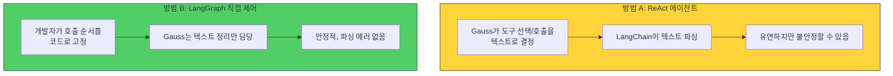

| 항목 | ReAct 에이전트 | LangGraph 직접 제어 |
| --- | --- | --- |
| Gauss 의존도 | 높음 (도구 선택도 Gauss가 결정) | 낮음 (Gauss는 텍스트 정리만) |
| 안정성 | JSON 파싱 실패 가능 | 매우 안정적 |
| 유연성 | 높음 (새 도구 추가 쉬움) | 보통 (코드 수정 필요) |
| 권장 상황 | Gauss JSON 출력이 안정적일 때 | Gauss 출력이 불안정할 때 |

---

## 8. 프로젝트 파일 구조

```
gauss-tool-calling/
├── docs/
│   ├── gauss-api.md                      # Gauss API 문서 (필사본)
│   ├── gauss-langchain-tool-calling-research.md  # 타당성 조사
│   ├── gauss-react-test-prompts.md       # ReAct 테스트 프롬프트
│   └── gauss-mcp-integration-guide.md    # 이 문서
├── src/
│   ├── gauss_llm.py                      # Gauss LangChain 래퍼
│   ├── react_agent.py                    # ReAct 에이전트
│   ├── context7_bridge.py                # Context7 MCP 연동
│   ├── langgraph_bridge.py               # LangGraph 고급 버전
│   ├── skill_generator.py                # Skills 파일 생성기
│   └── gauss_skill_cli.py                # CLI 도구
├── skills/                               # 생성된 Skills 파일
│   ├── react-19-useeffect.md
│   ├── nextjs-16-app-router.md
│   └── ...
├── requirements.txt
└── README.md
```

---

## 9. 설치 및 실행

### 9.1 의존성 설치

```bash
pip install langchain langchain-core langchain-mcp-adapters langgraph requests
npm install -g @upstash/context7-mcp  # 또는 npx로 자동 설치
```

### 9.2 환경변수 설정

```bash
export GAUSS_ENDPOINT="http://gauss-internal.company.com"
export GAUSS_CLIENT_KEY="your-client-key"
export GAUSS_PASS_KEY="your-pass-key"
export GAUSS_EMAIL="your@company.com"
export GAUSS_MODEL_ID="your-model-id"
```

### 9.3 실행

```bash
# 단일 주제 검색 → Skills 파일 생성
python src/gauss_skill_cli.py "React 19 useEffect 최신 사용법"

# 생성된 파일 확인
cat skills/react-19-useeffect.md

# 코딩 에이전트에서 Skills 파일 참조
# → 에이전트 설정에서 skills/ 디렉토리를 참조 경로로 추가
```

---

## 10. 요약

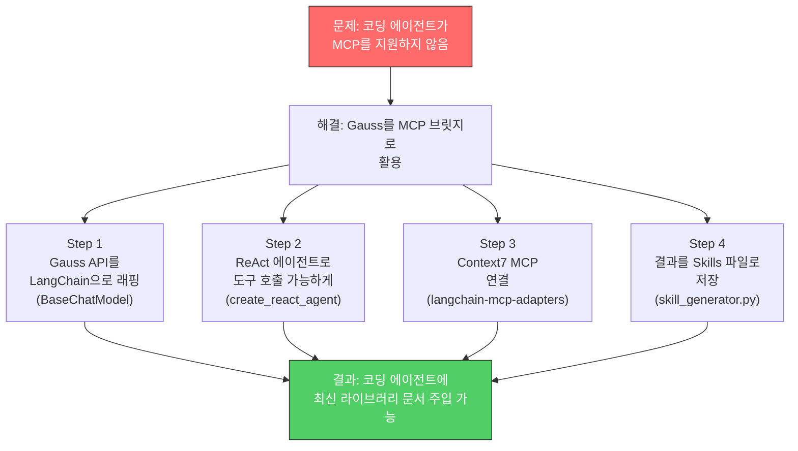

| 단계 | 무엇을 | 어떻게 |
| --- | --- | --- |
| Step 1 | Gauss를 LangChain에서 사용 | `BaseChatModel` 상속, `_generate` 구현 |
| Step 2 | 도구 호출 가능하게 | `create_react_agent` 또는 LangGraph |
| Step 3 | Context7 최신 문서 검색 | `langchain-mcp-adapters`로 MCP 연결 |
| Step 4 | 코딩 에이전트에 주입 | Skills `.md` 파일로 저장 |

---

## 참고 자료

- [LangChain Custom Chat Model 가이드](https://python.langchain.com/docs/how_to/custom_chat_model/)
- [LangChain BaseChatModel API](https://api.python.langchain.com/en/latest/language_models/langchain_core.language_models.chat_models.BaseChatModel.html)
- [LangGraph Quickstart](https://docs.langchain.com/oss/python/langgraph/quickstart)
- [langchain-mcp-adapters GitHub](https://github.com/langchain-ai/langchain-mcp-adapters)
- [Context7 MCP](https://context7.com)